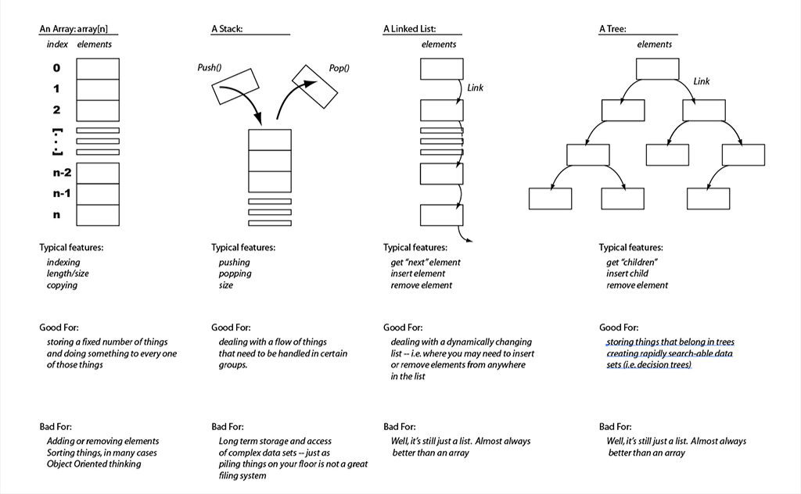
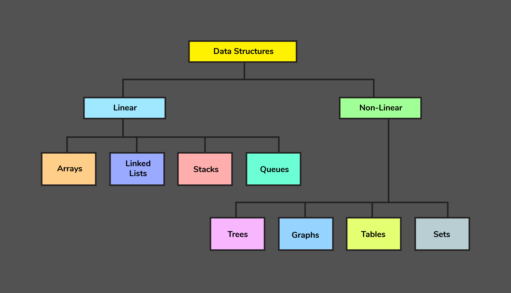
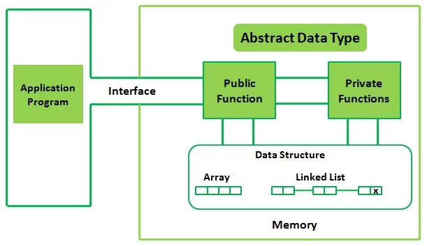

<!-- 
<strong>Lecture Notes • Source Code • Resources • by @Shavkatjon-O</strong>
 -->

<!-- 
Your must-have cheat sheet on Data Structures and Algorithms! 🚀
 -->

<!-- > Welcome to the Data Structures and Algorithms repository! This repository contains lecture notes and source code implementations of various data structures and algorithms in C++, Java, and Python. -->

<!-- **Made by** [Shavkatjon-O](https://github.com/Shavkatjon-O) ⚡️ -->

<h1 align="center">Data Structures and Algorithms</h1>

<!--  -->

## Table of Contents

- [Introduction](#introduction)
- [Data Structures](#data-structures)
  - [Basics of Data Structures](#data-structures-basics)
    - [Introduction](#data-structures-introduction)
    - [Abstract Data Types](#abstract-data-types)
    - [Asymptotic Notation](#asymptotic-notation)
    - [Analyzing Runtime Complexity](#analyzing-runtime-complexity)
    - [Analyzing Space Compexity](#analyzing-space-complexity)
- [Computer Algorithms](#computer-algorithms)

<!--  -->

<h1 align="center">Data Structures</h1>

<!--  -->

## Basics of Data Structures

### Introduction

What is a data structure?

A **Data Structure** is a way of organizing and storing data to perform operations efficiently. It defines the relationship and operations that can be performed on the data, providing a means to access and manipulate it in a structured and organized manner.

> Examples include **arrays**, **linked lists**, **stacks**, and **queues**.

- **Data** - data are simply value or set of values.
- **Data Structure** - usually refers to an organization of data in main memory.
- **Problem** - is a challenge or obstacle that requires a solution or resolution.
- **Algorithm** - is a step-by-step set of instructions or rules to solve a specific problem or perform a task.
- **Program** - is a set of coded instructions that a computer can execute to perform a specific task or solve a particular problem.

### Abstract Data Types

What is an abstract data type?

An **Abstract Data Type (ADT)** is like a blueprint for handling information. It defines what operations you can do with the data, but it doesn't say exactly how to do them. It's like having a remote control for a TV — you know what buttons (operations) to press, but you don't need to know the inner workings of the TV (implementation details). Examples of ADTs are like different types of remotes for various devices, each with its own set of buttons.

- **Abstraction** - means focusing on what operations you can do with the data, without worrying about how those operations are done behind the scenes. It's like using a tool without needing to know how it's built.

- **Encapsulation** - in programming encapsulation is like packaging data and the methods that work on that data together. It keeps the inner workings hidden and allows controlled access, making code more organized, secure, and flexible.

### Asymptotic Notation

**Asymptotic Notation** is a fundamental concept in computer science and mathematics that allows us to describe the behavior of algorithms and functions as their input size approaches infinity.

> The term *Asymptotic Notation* comes from **mathematics** and widely used in **computer science** for measuring complexity of an algorithm in terms of **time** and **space**.

### Analyzing Runtime Complexity
### Analyzing Space Complexity

<!--  -->

## License
Have a look at the [license](https://github.com/Shavkatjon-O/dsa-lecture-notes/blob/main/LICENSE) file