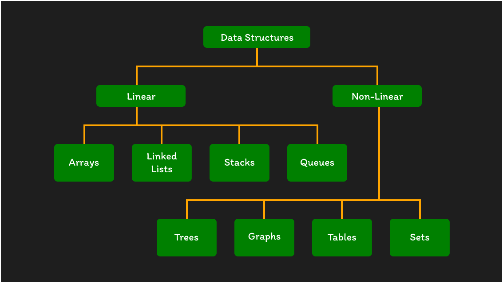
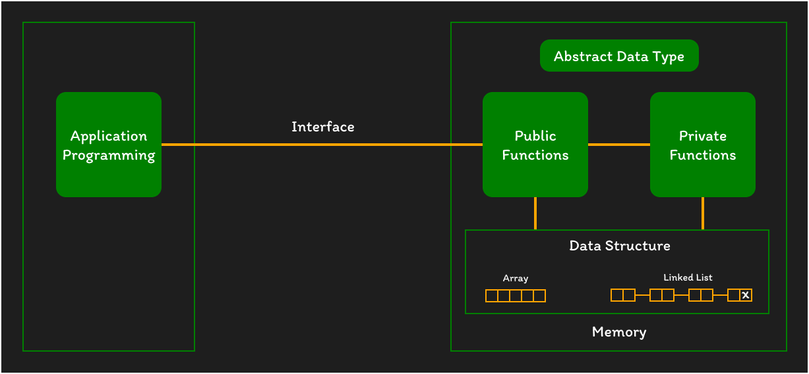

<!-- <p align="center"><strong>Lecture Notes • Source Code • Resources • by @Shavkatjon-O</strong></p> -->

<!-- <p align="center">Your must-have cheat sheet on Data Structures and Algorithms! 🚀</p> -->

<!-- > Welcome to the Data Structures and Algorithms repository! This repository contains lecture notes and source code implementations of various data structures and algorithms in C++, Java, and Python. -->

<!-- **Made by** [Shavkatjon-O](https://github.com/Shavkatjon-O) ⚡️ -->

<!-- <h1 align="center">Data Structures and Algorithms</h1> -->

<!--  -->

<!--  -->

<!-- ## Resources

- Data Structures and Algorithms by [Abdul Bari](https://www.youtube.com/watch?v=0IAPZzGSbME&list=PLAXnLdrLnQpRcveZTtD644gM9uzYqJCwr)
- Data Structures by [Neso Academy](https://www.youtube.com/watch?v=xLetJpcjHS0&list=PLBlnK6fEyqRj9lld8sWIUNwlKfdUoPd1Y) -->

<!-- ## Table of Contents -->

<!-- - [Data Structures](#data-structures)
  - [Basics of Data Structures](#basics-of-data-structures)
    - [Introduction](#introduction)
    - [Abstract Data Types](#abstract-data-types)
    - [Asymptotic Notation (O, Ω, Θ)](#asymptotic-notation)
    - [Analyzing Time Complexity](#analyzing-time-complexity)
    - [Analyzing Space Compexity](#analyzing-space-complexity)
  - [Searching and Sorting Algorithms](#searching-and-sorting-algorithms)
    - [Linear Search](#linear-search)
    - [Binary Search](#binary-search)
    - [Selection Sort](#selection-sort)
    - [Bubble Sort](#bubble-sort)
    - [Insertion Sort](#insertion-sort)
    - [Merge Sort](#merge-sort)
    - [Quick Sort](#quick-sort)
    - [Heap Sort](#heap-sort)
- [Computer Algorithms](#computer-algorithms) -->

<!--  -->

<h1 align="center">Data Structures</h1>



<!--  -->

## Basics of Data Structures

### Introduction

**What is a data structure?**

A **Data Structure** is a way of organizing and storing data to perform operations efficiently. It defines the relationship and operations that can be performed on the data, providing a means to access and manipulate it in a structured and organized manner.

Examples of data structures include *arrays*, *linked lists*, *stacks*, and *queues*.

- **Data** - data items refers to a single unit of value.
- **Data Type** - a data type is a collection of values and set of operations that act on those values.
- **Data Structure** - usually refers to an organization of data in main memory.
- **File Structure** - an organization for data on peripheral storage, such as a disk drive or tape.
- **Problem** - is a challenge or obstacle that requires a solution or resolution.
- **Algorithm** - is a step-by-step set of instructions or rules to solve a specific problem or perform a task.
- **Program** - is a set of coded instructions that a computer can execute to perform a specific task or solve a particular problem.

### Abstract Data Types

Two important things about *data types*:
- Definesa certain domain of values.
- Defines Operations allowed on those values.

Ex. *float* type:
- Takes only floating point values.
- Operations: addition, substraction, multiplication, division etc (bitwise and % operations are not allowed).

**What is user defined data type?**

The operations and values of user defined data types are not specified in the language itself but is specified by the user.

Example - *structure*, *union* and *enumeration*.

By using structures, we are defining our own type by combining other data types.

```cpp
struct point {
  int x;
  int y;
}
```

**What is an abstract data type?**

An **abstract data type** is like a blueprint for handling information. It defines what operations you can do with the data, but it doesn't say exactly how to do them.

> EXAMPLE: It's like having a remote control for a TV, you know what buttons (operations) to press, but you don't need to know the inner workings of the TV (implementation details). Examples of ADTs are like different types of remotes for various devices, each with its own set of buttons.

ADTs are like user defined data types which defines operations on values using functions without specifying what is there inside the function and how the operations are performed.

Example - *Stack* ADT

A **stack** consists of elements of same type arranged in a sequential order.

- **initialize()** - initializing it to empty.
- **push()** - insert an element into the stack.
- **pop()** - delete an element from the stack.
- **isEmplty** - checks if stack is empty.
- **isFull** - checks if stack is full.

There are multiple ways of implementing an ADT

Example - a stack ADT can be implemented using arrays or linked lists.

**Why ADT?**

1. The program which uses data structure is called a client program. it has access to the ADT i.e interface.
2. The program which implements the structure is known as the implementation.



An **ADT** describes a set of objects sharing the same properties and behaviours.
- The properties of an ADT are its data.
- The behavioursof an ADT are its operations or functions.

Thus, an **ADT** couples its data and operations.
- OOP emphasizes data abstraction

- **Abstraction** - means focusing on what operations you can do with the data, without worrying about how those operations are done behind the scenes. It's like using a tool without needing to know how it's built.

- **Encapsulation** - in programming encapsulation is like packaging data and the methods that work on that data together. It keeps the inner workings hidden and allows controlled access, making code more organized, secure, and flexible.

A data structure is the physical implementation of an ADT.

### Asymptotic Notation

Efficiency of data structures is always measured in terms of **TIME** and **SPACE**.

An ideal data structure could be the one that takes the least possible time for all its operations and consumes the least memory space.

<!-- **Asymptotic Notation** is a way of expressing the efficiency or performance of an algorithm by focusing on how its runtime or resource usage grows as the input size increases. It's a mathematical notation that helps computer scientists describe the upper and lower bounds of an algorithm's behavior without getting into the nitty-gritty details. -->

<!-- The term *Asymptotic Notation* comes from **mathematics** and widely used in **computer science** for measuring complexity of an algorithm in terms of **time** and **space**. -->


There are three commonly used asymptotic notations:

- **Big O Notation (O)** - This represents the upper bound or worst-case scenario of an algorithm's growth. It gives an upper limit on the rate of growth of the algorithm's running time as the input size increases.

- **Example** - If an algorithm is O(n^2), it means that the worst-case running time grows quadratically with the size of the input.

- **Omega Notation (Ω)** - This represents the lower bound or best-case scenario of an algorithm's growth. It provides a lower limit on the rate of growth of the algorithm's running time.

- **Example** - If an algorithm is Ω(n), it means that the best-case running time grows linearly with the size of the input.

- **Theta Notation (θ)** - This is a combination of Big O and Omega notations, providing both upper and lower bounds. It gives a tight bound on the growth rate of an algorithm.

- **Example** - If an algorithm is θ(n), it means that both the best-case and worst-case running times grow linearly with the size of the input.

### Analyzing Time Complexity
### Analyzing Space Complexity

## Searching and Sorting Algorithms

### Linear Search

```python
def linear_search(array, target):
  for value in array:
    if value is target:
      return True
  return False
```

### Binary Search
### Selection Sort
### Bubble Sort
### Insertion Sort
### Merge Sort
### Quick Sort
### Heap Sort


<!--  -->

## License
Have a look at the [license](https://github.com/Shavkatjon-O/dsa-lecture-notes/blob/main/LICENSE) file